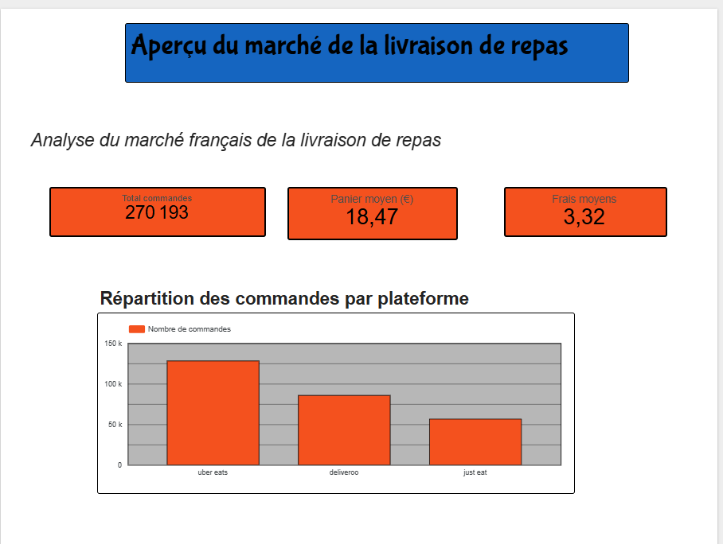
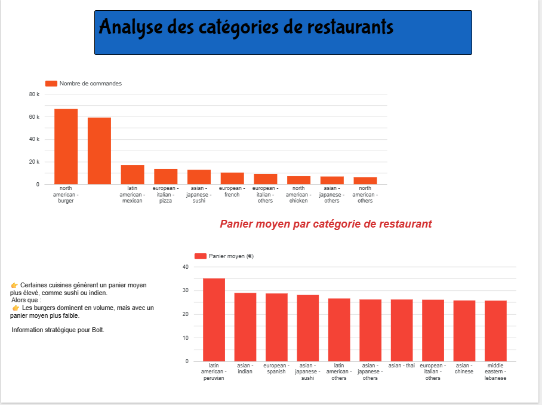
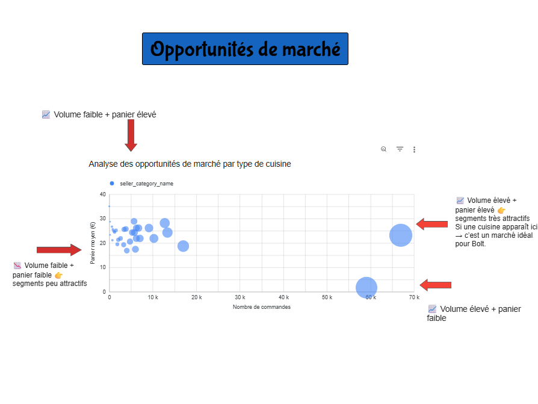

# Food Delivery Market Analysis – France

## Contexte

Ce projet analyse le marché français de la livraison de repas à partir d’un dataset de commandes.

L’objectif est de comprendre :
- la concurrence entre plateformes
- les catégories de restaurants les plus populaires
- les opportunités de marché.

## Outils utilisés

- SQL
- Google BigQuery
- Looker Studio

## Indicateurs clés

- Total commandes : 270 193
- Panier moyen : 18,47 €
- Frais moyens : 3,32 €

## Principaux insights

Uber Eats domine le marché, suivi par Deliveroo puis Just Eat.

Les restaurants de burgers génèrent le plus de commandes.

Certaines cuisines comme le sushi ou l’indien présentent un panier moyen plus élevé.

## Dashboard

Le dashboard permet de visualiser :

- l’aperçu du marché
- l’analyse des catégories de restaurants
- les opportunités de marché

## Dashboard

### Aperçu du marché

### Analyse des catégories de restaurants

### Opportunités de marché

